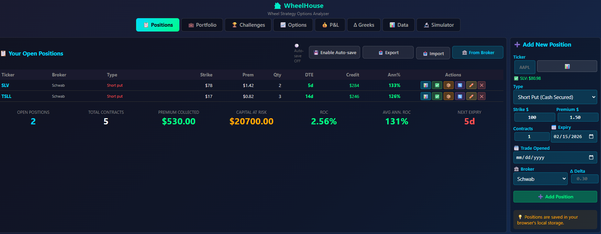
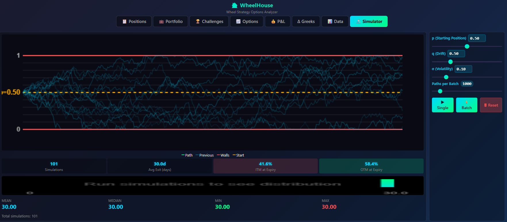
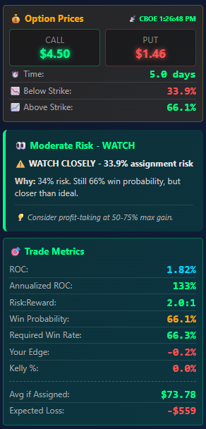

# 🏠 WheelHouse

**The Wheel Strategy Options Analyzer & Position Tracker**

A powerful Monte Carlo-based options analysis tool with **real-time CBOE pricing**, position tracking, and portfolio analytics - built specifically for traders running The Wheel Strategy.


---

## ✨ Key Features

### 📡 Real-Time CBOE Options Pricing
- **Live bid/ask/last prices** from CBOE's delayed quotes API
- **Staleness indicators** - Know when prices are stale vs fresh
- **Rate of Change (ROC)** tracking for mark-to-market P&L
- Automatic refresh with visual freshness indicators
- Fallback to Yahoo Finance when CBOE unavailable

### 💰 Monte Carlo Simulation Engine
- **10,000+ path Brownian motion** simulations
- Configurable drift, volatility, and time parameters
- Visual histogram of price distributions
- Probability cone visualization (1σ, 2σ, 3σ)

### 📊 Options Pricing & Greeks
- Black-Scholes analytical pricing
- Monte Carlo simulation-based pricing
- Delta, Gamma, Theta, Vega calculations
- Interactive payoff diagrams

### 📋 Position Tracker
- Track unlimited open positions
- **Automatic DTE calculation** with urgency colors
- ROC and Annualized ROC per position
- Edit, roll, close, or delete positions
- Assignment and called-away workflows
- **Chain tracking** - See your full roll history

### 💼 Portfolio Analytics
- Total premium collected
- Capital at risk calculations
- Weighted average annual ROC
- Win rate and P&L statistics
- Live unrealized P&L with CBOE prices

### 🏆 Trading Challenges
- Create time-bound trading challenges
- Link positions to challenges
- Track progress toward goals
- Visual progress bars

### 📈 Stock Holdings Tracker
- Track shares from assignments
- Cost basis management
- Covered call integration

---

## 🚀 Quick Start

### Windows
```batch
# 1. Clone the repository
git clone https://github.com/gregtee2/WheelHouse.git
cd WheelHouse

# 2. Install (auto-installs Node.js if needed)
install.bat

# 3. Run
start.bat
```

### Mac/Linux
```bash
# 1. Clone the repository
git clone https://github.com/gregtee2/WheelHouse.git
cd WheelHouse

# 2. Make scripts executable and install
chmod +x install.sh start.sh
./install.sh

# 3. Run
./start.sh
```

Browser opens automatically to **http://localhost:8888**

Your positions are saved locally - no account required!

---

## 🎯 The Wheel Strategy

The Wheel is an income strategy for stocks you want to own:

```
┌─────────────────┐     ┌─────────────────┐     ┌─────────────────┐
│  SELL PUT       │────▶│  GET ASSIGNED   │────▶│  SELL CALL      │
│  Collect $$$    │     │  Own shares     │     │  Collect $$$    │
└─────────────────┘     └─────────────────┘     └─────────────────┘
        │                                               │
        │ Expires worthless                             │ Shares called away
        ▼                                               ▼
   KEEP PREMIUM ←──────────────────────────────── START OVER
```

**WheelHouse helps you:**
- Analyze assignment probability before entering trades
- Track premium collected across your portfolio  
- Calculate optimal roll points when positions go against you
- Monitor your overall capital at risk

---

## 📁 Project Structure

```
WheelHouse/
├── server.js           # Node.js server (CBOE/Yahoo proxy)
├── index.html          # Main application shell
├── css/
│   └── styles.css      # Dark theme styling
└── js/
    ├── main.js         # Entry point, initialization
    ├── state.js        # Global state management  
    ├── api.js          # CBOE & Yahoo Finance API
    ├── pricing.js      # Black-Scholes, Monte Carlo
    ├── simulation.js   # Brownian motion engine
    ├── positions.js    # Position CRUD, localStorage
    ├── portfolio.js    # Portfolio analytics
    ├── challenges.js   # Trading challenges system
    ├── charts.js       # Canvas chart rendering
    ├── analysis.js     # Recommendations, EV calcs
    └── ui.js           # UI bindings, sliders
```

---

## 🔧 Configuration

The server runs on port **8888** by default. To change:

```javascript
// In server.js
const PORT = process.env.PORT || 8888;
```

---

## 📊 Screenshots

### Simulator - Monte Carlo Brownian Motion

*Run thousands of price path simulations to see probability distributions. Visualize how often positions expire ITM vs OTM with configurable volatility and DTE parameters.*

---

### Options Pricing - Black-Scholes & Greeks

*Calculate theoretical option prices using both Black-Scholes and Monte Carlo methods. View all Greeks (Delta, Gamma, Theta, Vega) and interactive payoff diagrams.*

---

### Open Positions - Live Tracking

*Track all your open wheel positions with real-time CBOE pricing. See DTE, current P&L, and staleness indicators. Mark prices manually or let CBOE auto-update.*

---

### Portfolio Summary - Capital at Risk

*Bird's eye view of your portfolio: total premium collected, capital at risk, weighted ROC, and live unrealized P&L across all positions.*

---

### Closed Positions - Trade History & Analysis

*Full audit trail of closed trades with Expiry dates, Days Held, Days Left (how early you exited), P&L, ROC%, and the "Left on Table" self-torture column. Track roll chains across multiple legs.*

---

### Trading Challenges - Goal Tracking

*Create time-bound trading challenges (e.g., "$3K in January"). Track progress with "To Go" stat, realized vs unrealized P&L, and only count positions opened within the challenge period for honest tracking.*

---

### Stock Holdings - Assignment Tracker

*Track shares from put assignments. Manage cost basis and integrate with covered call positions for the next leg of the wheel.*

---

## 🛠️ Tech Stack

- **Frontend**: Vanilla JavaScript (ES6 modules), Canvas API
- **Backend**: Node.js, Express
- **Data**: CBOE delayed quotes, Yahoo Finance fallback
- **Storage**: Browser localStorage (no database needed)

---

## 📝 License

MIT License - see [LICENSE](LICENSE) for details.

---

## 🤝 Contributing

Contributions welcome! Please open an issue first to discuss changes.

---

*Built for wheel traders who want data-driven decisions.* 🎰
