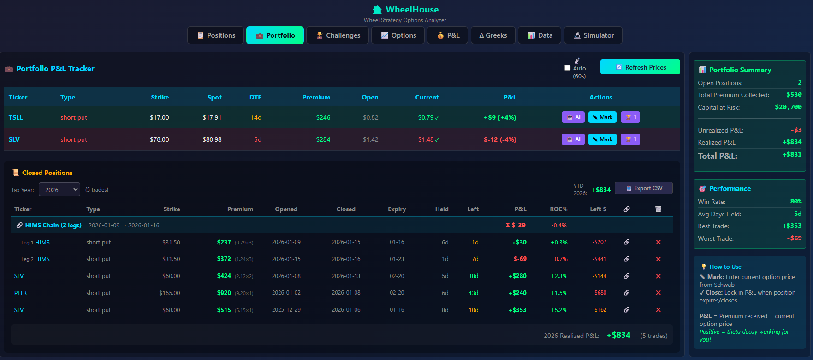
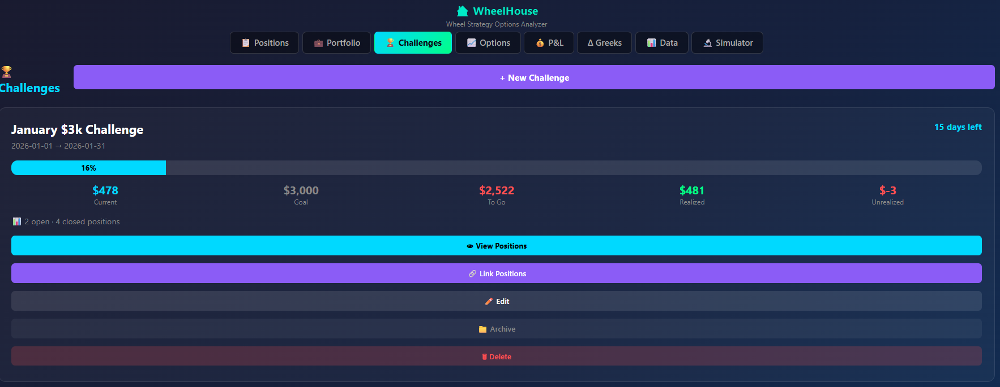
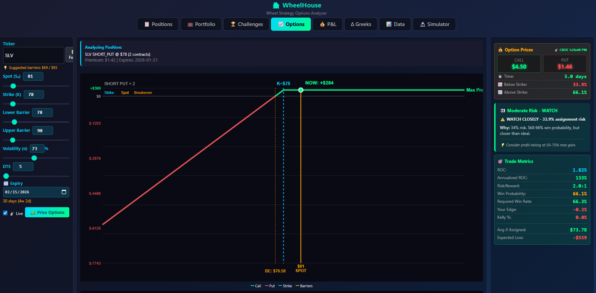

# 🏠 WheelHouse

**The Wheel Strategy Options Analyzer & Position Tracker**

A powerful Monte Carlo-based options analysis tool with **real-time Schwab & CBOE pricing**, AI-powered trade analysis, position tracking, and portfolio analytics - built specifically for traders running The Wheel Strategy.


---


## 🆕 What's New in v1.19.4

### 🛟 Comprehensive Button Tooltips
- **60+ tooltips added**: Hover over any button to see what it does
- **Better discoverability**: No more guessing - tooltips explain every function
- **All tabs covered**: Ideas, Analyze, P&L, Positions, Portfolio, Settings
- **Examples:**
  - "🔄 Scan Now" → "Scan for oversold stocks near 3-month lows - good wheel entry points"
  - "✨ Suggest" → "AI suggests optimal roll strikes based on current market conditions"
  - "💲 Refresh Prices" → "Fetch real-time option prices from Schwab (or CBOE if not connected)"
  - "🔄 Sync Positions" → "Import open positions from your selected Schwab account"

---

## 🆕 What's New in v1.19.3

### 🖨️ Print Report Button
- **One-click printing**: New "🖨️ Print Report" button in Week Summary
- **Print preview**: Full-screen preview before printing
- **Clean formatting**: Black & white friendly with proper headings, bullet points, and spacing
- **All data included**: Metrics grid + full AI analysis + timestamp

### 🐦 X Sentiment → Week Summary Integration (v1.19.2)
- **AI uses X insights**: The "Trending on X" report is now included in Week Summary AI analysis
- **Works with ALL models**: Ollama (Qwen) and Grok both see the pre-fetched X data
- **Better recommendations**: AI can reference Twitter sentiment when making position suggestions

### 🐦 Enhanced X/Twitter Sentiment (v1.19.1)
- **Full options coverage**: Now searches X for ALL your positions (stocks + options underlyings)
- **Sector-aware fallbacks**: If ticker has no buzz, searches sector keywords instead
  - IREN/CIFR → "Bitcoin mining", "crypto miners"
  - TSLL → "Tesla", "EV", "leveraged ETF"
  - INTC → "semiconductors", "chip stocks"
  - SLV → "silver", "precious metals"
- **Progress animation**: 4-step SSE streaming with visual progress bar
- **Every ticker reported**: Grok now reports sentiment for EACH of your tickers

### 📊 Week Summary Improvements (v1.19.0-1.19.1)
- **Fixed data source**: Now reads from your localStorage (correct account), not server autosave
- **Accurate closed trades**: Shows actual trades closed this week with correct P&L

---

## What's New in v1.18.1

### ⛽ Leverage Gauge - Margin Call Risk Based
Complete redesign of the leverage gauge to reflect **actual margin call risk**:

| Leverage | Zone | Color | What It Means |
|----------|------|-------|---------------|
| **0-100%** | Cash-Secured | 🟢 Green | Fully covered - no margin call possible |
| **100-200%** | Margin | 🟡 Yellow | Using margin, but safe - would need 50%+ total loss |
| **200-300%** | High Margin | 🟠 Orange | Getting risky - 33-50% adverse move is dangerous |
| **300%+** | Danger Zone | 🔴 Red | Margin call territory! |

- **Real-time updates**: Gauge updates every 2 seconds with streaming prices
- **What-If Mode**: Uncheck positions to see leverage impact of closing them
- **Visual indicators**: Zone markers at 100% and 200%, faint line shows original position in What-If mode

### 📊 Portfolio Improvements
- **Capital at Risk** now displayed in Portfolio balances banner
- **Net Liquidating Value** used instead of Margin Equity for accurate account value
- **Account Selection** prefers MARGIN account with highest equity

### 🔴 Real-Time Streaming (v1.18.0)
- **Live option quotes** via Schwab streaming API
- **Surgical DOM updates** - individual cells flash green/red, no full re-renders
- **No more screen flicker** during price updates

---


## 🆕 What's New in v1.17.36

### 📊 PMCC Calculator (Poor Man's Covered Call)
A complete calculator for managing LEAPS positions with short calls:

- **Pre-loads existing LEAPS**: Select from your 180+ DTE long call positions
- **Live chain integration**: "Load Chain" fetches real strikes/premiums from Schwab/CBOE
- **Breakeven Strike**: Shows exactly what strike you need to sell above to profit if assigned
  - Purple highlight: "Sell calls ABOVE $57.65 to profit if assigned"
  - Strikes color-coded: ✅ Safe (above breakeven), ⚠️ Risky (below breakeven)
- **Clear scenario outcomes**:
  - ✅ "If Stock Stays Below Strike" - You keep $47, LEAPS unchanged, repeat!
  - ⚠️ "If Assigned" - Step-by-step explanation of Exercise vs Close options
- **Roll Short Call**: When stock approaches your strike
  - Select new expiry/strike from chain
  - Shows Buy Back cost, New Premium, Net Credit/Debit
  - Stage roll to Ideas tab
- **Schwab-first pricing**: Real-time quotes with Yahoo fallback

### 🎯 Spread Enhancements (v1.17.25-26)
- **Shift Arrows (▲/▼)**: Move entire spread up/down chain while maintaining width
- **Win Probability**: Delta-based profit probability shown alongside R:R ratio
- **6-metric Risk Analysis grid**: R:R, Win Prob, Max Profit, Max Loss, Breakeven, Width

---

## 🆕 What's New in v1.17.24

### 📊 Enhanced Trade Confirmation Modals
- **Strike dropdowns show delta + bid**: `$95 ($2.85 | Δ0.30)` - see premium and assignment risk at a glance
- **IV display with color coding**: Blue (<30% low), White (30-50% normal), Orange (>50% high)
- **Consistent UI across all modals**: Single-leg, spreads, and roll calculator

### 🎯 Single-Leg Trades: New Decision Metrics
- **Cushion %**: How far stock can drop before breakeven (Green ≥15%, Orange 10-15%, Red <10%)
- **Win Probability**: Delta-based probability of profit (Green ≥70%, Orange 50-70%, Red <50%)
- Tooltips explain each metric on hover

### 📈 Spread Trades: Risk:Reward Analysis
- **R:R Ratio with rating**: 🎯 Excellent (<1.5:1), ✅ Good (<2:1), ⚠️ Marginal (2-3:1), ❌ Poor (>3:1)
- **Rich tooltip**: Shows exact dollar amounts for risk/reward
- **AI filtering**: Strategy Advisor now rejects spreads with R:R > 3:1

---

## 🆕 What's New in v1.16.0

### 🔗 Unified AI Position Lifecycle
The AI now tracks your trade from open to close - no more working in isolation!

```
📝 OPEN TRADE (Discord Analyzer / Trade Ideas)
   └─ Saves: Opening thesis, IV at entry, range position, AI verdict
       │
       ▼
🔍 POSITION CHECKUP (during trade)
   └─ Compares: Current conditions vs opening thesis
   └─ Asks: "Has your original thesis played out?"
   └─ Shows: IV change, range shift, days held
       │
       ▼
🔄 ROLL SUGGESTION (if needed)
   └─ Sees: Full chain history, total premium collected
   └─ Considers: Original thesis still valid?
       │
       ▼
📊 TRADE CRITIQUE (after close)
   └─ Reviews: Entry thesis vs actual outcome
   └─ Learns: What worked, what didn't
```

- **Opening Thesis Saved**: When you stage a trade, AI analysis is stored with the position
- **Checkups Reference Entry**: "You opened at 66% IV expecting mean reversion - IV now 45%"
- **Chain-Aware Rolls**: AI sees all previous rolls and total premium collected
- **Critique Has Full Context**: Reviews your original reasoning vs what actually happened

### 🌐 Unified AI Model Selector
- **One model setting for all features** - New dropdown in the header bar (next to Account switcher)
- **Local overrides available** - Each feature can still use a different model if needed
- **Consistent experience** - Strategy Advisor, Discord Analyzer, Trade Ideas, and Checkups all use the same model by default
- **Quick switching** - Change models mid-session without navigating to Settings

### 📊 Spread Position Support in AI
- **AI now understands spreads** - Portfolio Audit sends correct strike info for spreads
- **Calculated MaxProfit/MaxLoss** - AI sees real risk metrics, not null values
- **Proper [SPREAD] tagging** - AI prompts correctly identify spread positions

---

## 🆕 What's New in v1.17.0

### 🟢 Theta Decay Now Accurate
- **Theta decay now uses real IV from the options chain for each ticker**
- Deep OTM/ITM options show correct (small) theta, with tooltips explaining why
- Values under $1 now show cents (e.g. `+$0.45` instead of `+$0`)
- All positions fetch actual IV for Greeks, making theta/delta more accurate for volatile stocks

---

## 🆕 What's New in v1.15.0

### 📊 Strategy Advisor - Real Schwab Prices
- **Fixed critical pricing bug** - Now uses REAL bid/ask from Schwab, not synthetic estimates
- **All 9 strategies** evaluated with actual market data
- **Proper strike selection** - Uses valid CBOE strike increments ($1 for stocks >$50)
- **Correct delta direction** - Bull put spreads show POSITIVE delta (bullish!)
- **108 strikes analyzed** - Full range ±$15 from spot price
- **Model Picker** - Choose Qwen 7B/14B/32B, DeepSeek-R1, or Grok models
- **Range-Aware Recommendations** - Uses real 3-month range to recommend bullish/bearish strategies
- See [docs/FEATURES.md](docs/FEATURES.md) for "How It Works"

### Technical Improvements
- Deduplicate options by (strike, type), prefer ~30 DTE
- Filter by strike RANGE not "closest N to ATM"
- Uses Yahoo 3-month historical data for accurate range position
- Detailed server logging for debugging

---

## 📦 Previous: v1.14.0

### 🧠 Trading Pattern Memory
- **AI remembers your history!** When analyzing a new trade, AI checks your closed positions
- Warns about losing patterns: "TSLA short puts burned you before - 35% win rate"
- Encourages winners: "MSTX short puts have 80% win rate for you!"
- Works in Discord Analyzer and 💡 Get Insight
- See [docs/FEATURES.md](docs/FEATURES.md) for full details

### 📅 Custom Date Range Filtering
- **Filter closed positions by any date range** - not just by year
- New "📅 Custom Range" option in Year dropdown
- Perfect for monthly reviews, tax periods, market event analysis
- Filter applies to table, CSV export, and AI Historical Audit

### 📊 AI Historical Audit
- **New "🤖 AI Historical Audit" button** in Portfolio tab
- Grades your trading period (A/B/C/D/F)
- Finds patterns: what worked, what didn't, recommendations
- Model selector: choose 7B/14B/32B/DeepSeek-R1/Grok

### 📚 Feature Documentation
- **New [docs/FEATURES.md](docs/FEATURES.md)** with detailed "How It Works" explanations
- Architecture diagrams, thresholds, data flows documented
- Great for understanding the system deeply

---

## 📦 Previous: v1.13.0

### 🧠 Vector RAG Wisdom System
- **Semantic search for trading rules** - AI finds the most relevant wisdom entries using vector embeddings
- Uses `nomic-embed-text` model for embedding generation
- Relevance indicators: 🎯 (>70%), 📌 (>50%), 📚 (lower)
- AI must **CITE rules** and **EXPLAIN any overrides**

### ⚡ Pure Mode Toggle
- **New "📚 Apply Wisdom" checkbox** in AI Trade Advisor panel
- When unchecked, get raw AI analysis without your trading rules
- Visual indicators: "✓ Rules active" (green) or "⚡ Pure mode" (yellow)

### 🤖 Portfolio Audit Model Selector
- **Choose any AI model** directly in the audit modal
- **🔄 Re-run button** to compare models side-by-side
- Consistent emoji-structured output across all models

---

## 📦 Previous: v1.12.0

### 🖥️ Electron Desktop App
- **Standalone Windows application** - No more browser tabs
- Embedded Node.js server starts automatically
- Clean window with proper app title
- DevTools available in dev mode

### 🔐 Password-Protected Login
- **First launch prompts you to create a password** (6-12 characters)
- Supports letters, numbers, and special characters: `!@#$%^&*?`
- Password stored securely using SHA-256 hashing
- Login screen appears before any data is accessible

### 🔒 Secure Credential Storage
- **Windows Credential Manager** integration via Electron's safeStorage API
- **AES-256-GCM encryption** for all sensitive data
- Schwab tokens automatically migrated from .env to encrypted store
- Secured: SCHWAB_APP_KEY, SCHWAB_APP_SECRET, SCHWAB_REFRESH_TOKEN, SCHWAB_ACCESS_TOKEN, OPENAI_API_KEY, GROK_API_KEY, TELEGRAM_BOT_TOKEN

### 📦 Windows Installer
- **One-click NSIS installer** (~81MB)
- Installs to user's AppData folder (no admin required)
- Creates desktop shortcut
- Clean uninstaller included

### 🚀 Launcher Batch Files
- `WheelHouse.bat` - Main launcher, clears ports, starts Electron app
- `WheelHouse-Dev.bat` - Dev mode with Chrome DevTools open
- `WheelHouse-WebOnly.bat` - Legacy mode, just the Node.js server

---

## 📦 Previous: v1.11.0

### 🎯 Alternative Strategies AI
- When covered call is ITM, AI considers 5 strategies beyond just rolling
- Assignment scenario calculator shows exactly what you'd make if called
- Chain history context - AI sees full roll history

---

## 📦 Previous: v1.10.0

### 🏆 Win Rate Dashboard
- Win Rate percentage, Average DTE, Best/Worst ticker
- Cumulative P&L Chart with visual line graph
- Expiration Calendar with color-coded dots

---

## 📦 Previous: v1.9.0

### 📊 Per-Position Greeks
- **Delta (Δ) and Theta (Θ/day)** columns in Positions table
- Individual position Greeks calculated from Black-Scholes
- Neutral styling (pro trader aesthetic)

### 🤖 AI Portfolio Audit
- **Comprehensive AI analysis** of your entire portfolio
- Analyzes concentration risk, problem positions, Greeks balance
- Provides specific optimization suggestions (rolls, closes, adjustments)
- Saves context for use in future AI trade analysis

### 🧠 Portfolio-Aware AI Analysis
- **AI now considers your existing positions** when analyzing new trades
- Trade analysis warns about sector concentration
- Ideas feature suggests trades that balance your portfolio
- Context valid for 24 hours after audit

### 📅 Year Filter for Advanced Analytics
- Advanced Analytics now filters by selected year (matches Closed Positions filter)
- See "(2026)" or "(All Time)" label in header
- Compare current year vs historical performance

### 📥 Stage Roll Suggestions to Ideas
- **"Stage to Ideas" button** on each roll suggestion
- Purple **"ROLL" badge** in Pending Trades
- Call/Put indicator (C/P) with color coding
- Track roll candidates before executing with broker

### 📈 Conservative Kelly Calculator
- Now uses **Account Value + 25% of margin** (not full buying power)
- Much safer position sizing recommendations
- Tooltip explains the calculation

---

## 📦 Previous: v1.8.0

### 💹 Schwab API Integration (Real-Time Pricing!)
- **Schwab-first option pricing** - Real-time bid/ask/Greeks from your Schwab account
- **CBOE fallback** - Automatically falls back to CBOE delayed quotes if Schwab unavailable
- **Full Greeks** - Delta, Theta, Gamma, IV all from Schwab's live data
- **Win Probability** - Calculated from delta (e.g., -0.23 delta ≈ 77% profit probability)
- **Data source indicator** - 🔴 Schwab (real-time) vs 🔵 CBOE (15-min delayed)

### 🎯 Smart Strike Lookup
- **Finds REAL strikes** - No more guessing! Fetches all available strikes from Schwab
- **Auto-adjustment** - If you request $152 but only $150 exists, it uses $150 and tells you
- **Strike adjustment notes** - "⚠️ Using actual strike $150 (requested $152)"

### 📊 TradingView Charts for Staged Trades
- **📊 Chart button** on each staged trade
- **3-month chart** with **Bollinger Bands** pre-loaded
- **Dark theme** matching WheelHouse
- Perfect for checking if stock is oversold before entering

### 🗓️ Friday Expiry Validation
- **Auto-snaps to Fridays** - Options expire on Fridays, never weekends
- If AI says "Feb 21" (Saturday), auto-corrects to **"Feb 20"** (Friday)
- Prompt now shows exact valid expiry dates to AI

### 🤖 AI Trade Ideas Generator Improvements
- **54 curated stocks** + Yahoo Most Active + Trending discovery
- **10 ideas per run** (was 3)
- **Range position filtering** - Rejects stocks >70% of range (extended/risky)
- **"Show Different Stocks"** button for variety
- **15-minute cache** for Yahoo rate limiting

### 🔧 Bug Fixes
- Fixed IV display (was 6500%, now shows correct 65%)
- Fixed Deep Dive buttons not appearing (regex now handles **bold** markdown)
- Fixed localStorage persistence for trade ideas (24-hour cache)

---

## 📦 Previous: v1.7.0

### 🧠 AI Model Improvements
- **Model Selector for Discord Analyzer** - Choose 7B (fast), 14B, or 32B (best) - defaults to 32B
- **Model Warmup Button** - Pre-load models into GPU memory for instant responses
- **Real-time Progress** - See step-by-step progress during trade analysis with elapsed time
- **Smart Token Scaling** - Larger models get higher token limits for more detailed analysis

### 📊 Verdict Spectrum (New!)
Instead of binary FOLLOW/PASS, Discord Analyzer now gives **three perspectives**:
- 🟢 **AGGRESSIVE VIEW** - Bull case, probability of max profit
- 🟡 **MODERATE VIEW** - Balanced take with position sizing advice
- 🔴 **CONSERVATIVE VIEW** - What concerns would make you pass
- **BOTTOM LINE** - Who is this trade best suited for?

### 📈 Enhanced Thesis Tracking
- **Range Position Indicator** - See where stock is in its 3-month range (0%=low, 100%=high)
- **IV Saved at Entry** - Compare entry IV to current IV during checkups
- **Full Analysis Saved** - "View Full Entry Analysis" button to review original AI reasoning
- **Analysis History** - Track multiple AI analyses over time with market snapshots
- **Model Tracking** - Know which AI model was used for each analysis

### 🔧 Bug Fixes
- Fixed premium validation (stock prices no longer confused with option premiums)
- Fixed range position interpretation (7B model was saying 1%=high, now has emoji hints)
- Improved server restart handling (cleans up orphaned processes)

---

## 📦 Previous: v1.5.0

### 🤖 AI Trade Advisor
- **Deep Dive Analysis** - Comprehensive scenario analysis with CBOE live pricing
- **Discord Trade Analyzer** - Paste any trade callout for instant AI analysis
- **Spread Support** - Full risk/reward math for spreads
- **Position Checkup** - Compare opening thesis to current conditions
- **Trade Critique** - AI reviews closed trades with feedback

### 📊 Analysis Features
- **Stage → Confirm Flow** - Stage trades, confirm when executed
- **Thesis Storage** - Each position remembers WHY you entered
- **DTE Warnings** - Red flags for short-dated trades (≤7 days)
- **Spread Math** - Proper risk/reward (max profit, max loss, return on risk)

---

## ✨ Key Features

### 📡 Data Sources & Automatic Fallback

WheelHouse automatically detects what data sources you have and adapts - **no configuration needed**:

| Priority | Source | What You Get | Delay | Auth Required? |
|----------|--------|--------------|-------|----------------|
| 1️⃣ | **Schwab Streaming** | Live quotes, Greeks, fills | ~0 sec | ✅ Schwab account |
| 2️⃣ | **Schwab REST API** | Quotes, options chains | ~0 sec | ✅ Schwab account |
| 3️⃣ | **CBOE** | Options chains, stock prices | ~15 min | ❌ Free |
| 4️⃣ | **Yahoo Finance** | Stock prices only | ~0 sec | ❌ Free |
| 5️⃣ | **Black-Scholes** | Calculated option prices | N/A | ❌ Built-in |

**How it works:**
- **Have Schwab?** → Real-time streaming with live Greeks ✨
- **No Schwab?** → CBOE delayed quotes (still accurate, just 15-min old)
- **CBOE missing an option?** → Black-Scholes theoretical pricing

The app just *senses* what you have and uses the best available source. Old school still works great!

### 📡 Real-Time Options Pricing (Schwab + CBOE)
- **Schwab API integration** - Real-time bid/ask/last from your brokerage account
- **Full Greeks from Schwab** - Delta, Theta, Gamma, IV for accurate risk assessment
- **CBOE delayed quotes fallback** - 15-min delayed data when Schwab unavailable
- **Smart strike lookup** - Fetches all available strikes, finds closest match
- **Staleness indicators** - Know when prices are stale vs fresh
- **Rate of Change (ROC)** tracking for mark-to-market P&L
- Fallback to Yahoo Finance for stock quotes

### 💰 Monte Carlo Simulation Engine
- **10,000+ path Brownian motion** simulations
- Configurable drift, volatility, and time parameters
- Visual histogram of price distributions
- Probability cone visualization (1σ, 2σ, 3σ)

### 📊 Options Pricing & Greeks
- Black-Scholes analytical pricing
- Monte Carlo simulation-based pricing
- Delta, Gamma, Theta, Vega calculations
- Interactive payoff diagrams

### 📋 Position Tracker
- Track unlimited open positions
- **Automatic DTE calculation** with urgency colors
- ROC and Annualized ROC per position
- Edit, roll, close, or delete positions
- Assignment and called-away workflows
- **Chain tracking** - See your full roll history

### 💼 Portfolio Analytics
- Total premium collected
- Capital at risk calculations
- Weighted average annual ROC
- Win rate and P&L statistics
- Live unrealized P&L with CBOE prices

### 🏆 Trading Challenges
- Create time-bound trading challenges
- Link positions to challenges
- Track progress toward goals
- Visual progress bars

### 📈 Stock Holdings Tracker
- Track shares from assignments
- Cost basis management
- Covered call integration

### 🧠 AI Trade Advisor (Local + Cloud Options)
- **100% Local AI** - Runs entirely on your machine via [Ollama](https://ollama.com)
- **Cloud AI (Optional)** - Grok models for instant results without GPU
- **No subscriptions** - Grok has a free tier, Ollama is completely free

**AI Features:**

| Feature | Description |
|---------|-------------|
| **Strategy Advisor** | Enter any ticker → AI analyzes ALL strategies → recommends the best one |
| **Deep Dive** | Comprehensive analysis with CBOE live pricing, support/resistance, scenario modeling |
| **Discord Analyzer** | Paste any trade callout → AI parses it and gives FOLLOW/PASS/AVOID verdict |
| **Position Checkup** | Compare opening thesis to current market - has your trade thesis held up? |
| **Trade Critique** | Review closed trades with AI feedback on what went well/could improve |
| **Roll Advisor** | AI analyzes all roll options and recommends the best choice |
| **Spread Math** | Proper risk/reward for spreads (not the broken "naked put" math!) |

**Verdicts:**
- ✅ **ENTER/FOLLOW** - Good setup, trade worth taking
- ⚠️ **WAIT/PASS** - Not ideal entry, wait for better conditions
- ❌ **AVOID** - Poor risk/reward, skip this one

**Model Selection Guide:**

| Model | Type | Speed | Quality | Requirements |
|-------|------|-------|---------|--------------|
| **Qwen 7B** | Local | ~5 sec | Good | 8GB VRAM |
| **Qwen 14B** | Local | ~10 sec | Better | 16GB VRAM |
| **Qwen 32B** | Local | ~20 sec | Best Local | 24GB+ VRAM |
| **DeepSeek-R1** | Local | ~30 sec | Excellent | 24GB+ VRAM |
| **Grok-3** | Cloud | ~3 sec | Excellent | API key (free tier) |
| **Grok-4** | Cloud | ~10 sec | Best Overall | API key |
| **Grok 4.1 Fast** | Cloud | ~2 sec | Great | API key (fastest) |

**Which model should I use?**
- **No GPU**: Use Grok models (free tier available at [x.ai](https://x.ai))
- **8GB VRAM**: Qwen 7B
- **24GB+ VRAM**: Qwen 32B or DeepSeek-R1 (best reasoning)
- **Best quality**: Grok-4 or DeepSeek-R1
- **Fastest**: Grok 4.1 Fast (~2 seconds)

**GPU Requirements for Local AI:**
| Hardware | Speed | Notes |
|----------|-------|-------|
| NVIDIA GPU (8GB+ VRAM) | Fast (~5-10 sec) | RTX 3060 or better recommended |
| NVIDIA GPU (24GB+ VRAM) | Fast | Can run 32B model for best quality |
| Apple Silicon (M1/M2/M3) | Fast | Native Metal acceleration |
| CPU Only | Slow (~30 sec) | Works but not recommended |

---

## 🚀 Quick Start

### Windows
```batch
# 1. Clone the repository
git clone https://github.com/gregtee2/WheelHouse.git
cd WheelHouse

# 2. Install (auto-installs Node.js if needed)
install.bat

# 3. Run
start.bat
```

### Mac/Linux
```bash
# 1. Clone the repository
git clone https://github.com/gregtee2/WheelHouse.git
cd WheelHouse

# 2. Make scripts executable and install
chmod +x install.sh start.sh
./install.sh

# 3. Run
./start.sh
```

Browser opens automatically to **http://localhost:8888**

Your positions are saved locally - no account required!

---

## 🎯 The Wheel Strategy

The Wheel is an income strategy for stocks you want to own:

```
┌─────────────────┐     ┌─────────────────┐     ┌─────────────────┐
│  SELL PUT       │────▶│  GET ASSIGNED   │────▶│  SELL CALL      │
│  Collect $$$    │     │  Own shares     │     │  Collect $$$    │
└─────────────────┘     └─────────────────┘     └─────────────────┘
        │                                               │
        │ Expires worthless                             │ Shares called away
        ▼                                               ▼
   KEEP PREMIUM ←──────────────────────────────── START OVER
```

**WheelHouse helps you:**
- Analyze assignment probability before entering trades
- Track premium collected across your portfolio  
- Calculate optimal roll points when positions go against you
- Monitor your overall capital at risk

---

## 📁 Project Structure

```
WheelHouse/
├── server.js           # Node.js server (CBOE/Yahoo proxy)
├── index.html          # Main application shell
├── css/
│   └── styles.css      # Dark theme styling
└── js/
    ├── main.js         # Entry point, initialization
    ├── state.js        # Global state management  
    ├── api.js          # CBOE & Yahoo Finance API
    ├── pricing.js      # Black-Scholes, Monte Carlo
    ├── simulation.js   # Brownian motion engine
    ├── positions.js    # Position CRUD, localStorage
    ├── portfolio.js    # Portfolio analytics
    ├── challenges.js   # Trading challenges system
    ├── charts.js       # Canvas chart rendering
    ├── analysis.js     # Recommendations, EV calcs
    └── ui.js           # UI bindings, sliders
```

---

## 🔧 Configuration

The server runs on port **8888** by default. To change:

```javascript
// In server.js
const PORT = process.env.PORT || 8888;
```

---

## 📊 Screenshots

### Portfolio - Open Positions Dashboard

*Your main dashboard showing all open wheel positions at a glance. View DTE, premium collected, capital at risk, and live P&L across your entire portfolio.*

---

### Positions - Live Tracking with CBOE Prices

*Detailed position view with real-time CBOE pricing. See current option prices, staleness indicators, unrealized P&L, and quick actions for rolling, closing, or analyzing each trade.*

---

### Trading Challenges - Goal Tracking

*Create time-bound trading challenges (e.g., "$3K in January"). Track progress with the "To Go" stat, realized vs unrealized P&L, and only positions opened within the challenge period count for honest tracking.*

---

### Options Pricing - Black-Scholes & Monte Carlo

*Calculate theoretical option prices using both Black-Scholes and Monte Carlo methods. View probability of profit, expected value, and risk/reward analysis before entering trades.*

---

### P&L Analysis - Payoff Diagrams & Risk Visualization

*Visual P&L analysis tools: payoff diagram at expiration, probability cone (1σ, 2σ, 3σ), break-even analysis, roll calculator, and an interactive P&L heat map showing profit/loss zones across stock price and days to expiry.*

---

### Simulator - Monte Carlo Brownian Motion

*Run thousands of price path simulations to visualize probability distributions. See how often positions expire ITM vs OTM with configurable volatility and DTE parameters.*

---

### Trade Metrics - Risk Analysis Panel

*Real-time risk assessment showing assignment probability, ROC, annualized returns, risk/reward ratio, win probability, Kelly criterion, and expected loss if assigned. The "Moderate Risk - WATCH" banner gives actionable guidance.*

---

## 🛠️ Tech Stack

- **Frontend**: Vanilla JavaScript (ES6 modules), Canvas API
- **Backend**: Node.js, Express
- **Data**: CBOE delayed quotes, Yahoo Finance fallback
- **Storage**: Browser localStorage (no database needed)

---

## 📝 License

This project is licensed under a custom license. The software is provided for personal, non-commercial use only. Redistribution, modification, or commercial use is prohibited without explicit written permission from the copyright holder.

See the [LICENSE](LICENSE) file for details.

---

## 🤝 Contributing

Contributions welcome! Please open an issue first to discuss changes.

---

*Built for wheel traders who want data-driven decisions.* 🎰
